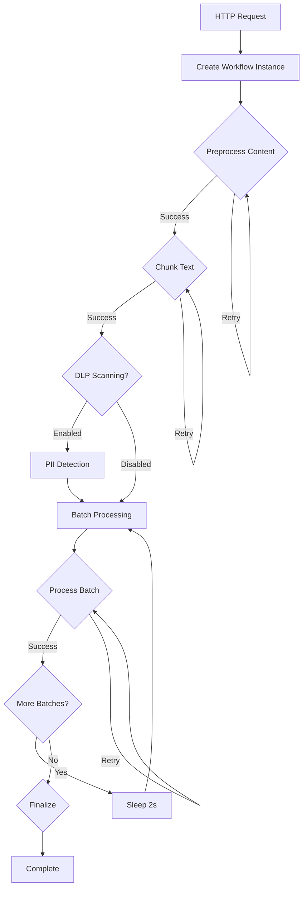

# Document Processing Workflow Example

## Overview

The Ingest Service now supports Cloudflare Workflows for document processing, providing better reliability, observability, and error handling.

## Workflow Features

### 1. **Discrete Steps with State Persistence**

- **Preprocess Content**: Text cleaning and validation
- **Chunk Text**: Break document into manageable chunks
- **DLP Scanning**: Optional PII/sensitive data detection (placeholder)
- **Batch Processing**: Process chunks in configurable batches (default: 5 chunks)
- **Finalization**: Validation and cleanup

### 2. **Advanced Error Handling**

- Configurable retry policies per step
- Exponential backoff for transient failures
- Batch-level error tolerance (fails if >50% of batch fails)
- Detailed error logging and context

### 3. **Observability**

- Real-time status tracking via `/workflow/{instanceId}`
- Step-by-step progress monitoring
- Performance metrics (processing time, success rates)
- Detailed error reporting

## API Endpoints

### Start Workflow Processing

```bash
POST /process-workflow
Content-Type: application/json

{
  "documents": [
    {
      "id": "doc-123",
      "text": "This is a sample document...",
      "source": "upload",
      "url": "https://example.com/doc.pdf",
      "metadata": {
        "acl": ["user:123", "group:admin"]
      }
    }
  ],
  "options": {
    "chunkSize": 1000,
    "overlap": 200,
    "retryLimit": 3,
    "dlpEnabled": false
  }
}
```

**Response** (202 Accepted):

```json
{
  "success": true,
  "message": "1 workflow(s) queued for processing",
  "results": [
    {
      "documentId": "doc-123",
      "workflowInstanceId": "wf-abc123",
      "status": "queued"
    }
  ],
  "totalWorkflows": 1
}
```

### Check Workflow Status

```bash
GET /workflow/wf-abc123
```

**Response**:

```json
{
  "instanceId": "wf-abc123",
  "status": "running",
  "output": null,
  "error": null,
  "timestamp": "2025-09-17T10:30:00.000Z"
}
```

## Workflow CLI Commands

### Deploy the Worker with Workflow

```bash
cd apps/ingest-service
npx wrangler deploy
```

### Trigger Workflow via CLI

```bash
npx wrangler workflows trigger ingest-service '{
  "document": {
    "id": "test-doc-1",
    "text": "This is a test document for workflow processing...",
    "source": "cli-test"
  },
  "options": {
    "retryLimit": 2
  }
}'
```

### Check Workflow Status via CLI

```bash
# Get latest instance
npx wrangler workflows instances describe ingest-service latest

# Get specific instance
npx wrangler workflows instances describe ingest-service wf-abc123
```

## Workflow Architecture Benefits

### 1. **Reliability**

- Each step is independently retriable
- State persistence prevents full restart on partial failures
- Configurable retry policies for different failure types

### 2. **Scalability**

- Asynchronous processing doesn't block HTTP requests
- Parallel document processing via multiple workflow instances
- Batch processing optimizes throughput while maintaining reliability

### 3. **Observability**

- Real-time progress tracking
- Step-level timing and error metrics
- Detailed failure analysis and debugging

### 4. **Flexibility**

- Configurable processing options per document
- Easy to add new processing steps
- Can handle long-running operations (hours/days)

## Processing Flow



## Migration from Synchronous Processing

The original `/process` endpoint remains available for backward compatibility, but new applications should use `/process-workflow` for the following benefits:

- **Better error handling**: Failed chunks don't impact successful ones
- **Progress tracking**: Know exactly which steps completed
- **Resource optimization**: Large documents don't timeout HTTP connections
- **Retry intelligence**: Different retry strategies for different failure types

## Configuration

Workflow settings can be customized per request:

```typescript
interface ProcessingOptions {
  chunkSize?: number // Characters per chunk (default: varies by chunking strategy)
  overlap?: number // Overlap between chunks (default: varies by chunking strategy)
  retryLimit?: number // Max retries per step (default: 3)
  dlpEnabled?: boolean // Enable PII detection (default: false)
}
```

## Monitoring and Debugging

1. **Real-time Status**: Use `/workflow/{instanceId}` for live progress
2. **CLI Inspection**: Use `wrangler workflows instances describe` for detailed step analysis
3. **Error Context**: Each failure includes step context and retry history
4. **Performance Metrics**: Track processing time per step and overall workflow

This workflow-based approach makes document processing more robust and observable while maintaining the simplicity of the original API.
